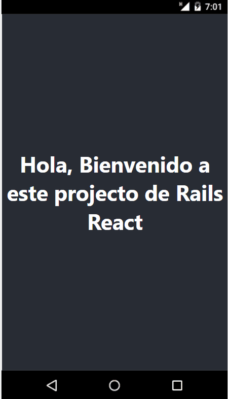

# Hello React front-end app
> A web app that greets you in five different languages

## Built With

- JavaScript
- React
- Redux

## Getting Started

To get a local copy follow these simple example steps.  

1.- Open the terminal window and clone the repository using this command:  
`git@github.com:VicPeralta/hello-react-front-end.git` 

2.- Change the directory to the hello-react-front-end directory  
`cd hello-react-front-end`  
3.- Install the project's dependencies by running this command:   
`npm install`  
4.- Generate the dist folder using this command:  
`npm run build`  
5.- Start the server at `http://127.0.0.1:3100`   
6.- Verify the availability of the endpoint 'http://127.0.0.1:3100/show.json'   
7.- Run this command to see the page `npm start`  
8.- To see the code open the project in the code editor of your preference.  

## Server repo
Get the server repo at [server]()

## Author

👤 **Victor Peralta**
- GitHub: [@VicPeralta](https://github.com/VicPeralta)
- Twitter: [@VicPeralta](https://twitter.com/VicPeralta)
- Linkedin: [@VicPeralta](https://www.linkedin.com/in/vicperalta/)

## 🤝 Contributing

Contributions, issues, and feature requests are welcome!

Feel free to check the [issues page](../../issues/).

## Show your support

Give a ⭐️ if you like this project!

## Acknowledgments
- A special thank for @fernandorpm for this amazing [README template](https://github.com/microverseinc/readme-template)

## 📝 License

This project is [MIT](./LICENSE.md) licensed.

